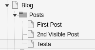
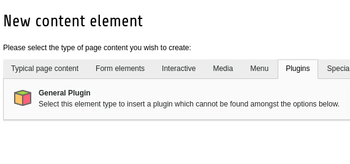
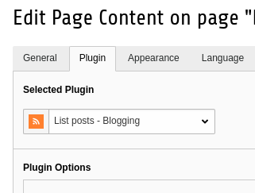
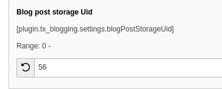

# Blogging

Minimal blog extension that makes use of TYPO3s core elements.

## Download

[blogging on TER](https://extensions.typo3.org/extension/blogging/)

Or just install it via composer

```
composer require atomicptr/blogging
```

# Documentation

## Basic setup

1. Make a tree structure like this:

    

1. The sysfolder "Posts" is where your posts will go later, in my case I hae 3 test posts: "First post", "2nd Visible Post" and "Testa"
1. Write down the page ID (you can see it by hovering over the sysfolder icon) of your "Posts" sysfolder (in my case it's id=**56**)
1. Add a "General Plugin" to the site where you want the posts to be listed

    

1. Select the "List Posts - Blogging" plugin on the "Plugin" tab

    

1. Open the constants editor (or just set the constant yourself) for "PLUGIN.TX_BLOGGING" and set it to the page ID you saved earlier (56, in my case)

    

1. Write some posts! :)

## Configuration

coming soon...